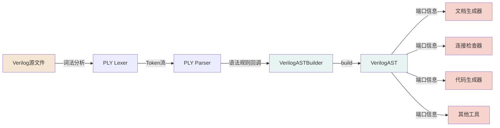

# VerilogAST 模块集成规范文档

**文档类型**: 集成规范 (Integration Specification)  
**版本**: v1.0  
**目标读者**: 上下游模块开发者、系统集成工程师  
**文档目的**: 指导如何在PLY解析器及后续处理流程中正确集成和使用VerilogAST模块

---

## 1. 模块定位

### 1.1 功能定位
VerilogAST是一个**轻量级的端口解析抽象语法树模块**，专注于从Verilog源码中提取模块的结构化信息（端口和参数），为后续工具链提供标准化的数据接口。

### 1.2 适用场景
- ✅ Verilog模块接口文档生成器
- ✅ 端口连接检查工具
- ✅ 模块实例化代码生成器
- ✅ 设计层次分析工具
- ✅ 端口宽度匹配验证器
- ✅ Testbench自动生成器

### 1.3 不适用场景
- ❌ 完整的Verilog语法解析（仅支持端口/参数）
- ❌ RTL逻辑综合和优化
- ❌ 时序分析和仿真

---

## 2. 系统架构

### 2.1 模块在工具链中的位置

### 2.2 数据流向

```
输入侧（上游）：PLY Parser↓
VerilogASTBuilder（构建阶段）
    ↓
VerilogAST（查询阶段）
    ↓
输出侧（下游）：各类分析工具
```

---

## 3. 集成方式

### 3.1 安装与依赖

#### 依赖项
```python
# requirements.txt
ply>=3.11           # PLY解析器库
sympy>=1.12         # 表达式计算（内部使用）
```

#### 导入方式
```python
from verilog_ast import (
    VerilogASTBuilder,
    VerilogAST,
    PortInfo,
    ParameterInfo,
    PortType,
    PortDirection,
    VerilogASTError
)
```

---

## 4. 上游集成指南（PLY Parser侧）

### 4.1 集成架构

#### 4.1.1 Parser类结构
```python
import ply.yacc as yacc
from verilog_ast import VerilogASTBuilder

class VerilogParser:
    def __init__(self):
        self.lexer = VerilogLexer()  # 你的Lexer
        self.parser = yacc.yacc(module=self)
        # 关键：为每个模块创建独立的builder
        self.current_builder = VerilogASTBuilder()
        self.parsed_asts = []  # 存储解析结果
    
    def parse(self, verilog_code):
        result = self.parser.parse(verilog_code, lexer=self.lexer)
        return result
```

---

### 4.2 语法规则集成模式

#### 4.2.1 模块声明规则

```python
def p_module_declaration(p):
    '''module_declaration : MODULE IDENTIFIER parameter_list_opt port_list_opt SEMICOLON module_body 
                          ENDMODULE'''
    # 注意：这是最后执行的规则
    pass# 暂不处理，等待p_design_unit

def p_design_unit(p):
    '''design_unit : module_declaration'''
    #✅ 关键点：这是PLY最后调用的规则，在此构建AST
    try:
        ast = self.current_builder.build()
        self.parsed_asts.append(ast)
        
        # 重置builder为下一个模块做准备
        self.current_builder.reset()
        
        p[0] = ast
    except VerilogASTError as e:
        print(f"AST构建失败: {e}")
        p[0] = None
```

---

#### 4.2.2 模块名称处理

```python
def p_module_header(p):
    '''module_header : MODULE IDENTIFIER'''
    module_name = p[2]
    # ✅ 步骤1：设置模块名
    self.current_builder.set_module_name(module_name)
    p[0] = module_name
```

---

#### 4.2.3 参数声明处理

**场景1：模块参数列表（Verilog-2001）**
```python
def p_parameter_declaration_in_header(p):
    '''parameter_declaration : PARAMETER param_type_opt IDENTIFIER ASSIGN expression'''
    param_name = p[3]
    param_value = p[5]  # 表达式字符串
    
    # ✅ 添加参数到builder
    self.current_builder.add_parameter(
        param_name,
        param_type="parameter",
        default_value=param_value
    )
    p[0] = (param_name, param_value)
```

**场景2：模块内部参数（两版本通用）**
```python
def p_parameter_declaration_in_body(p):
    '''parameter_stmt : PARAMETER param_assignments SEMICOLON
                      | LOCALPARAM param_assignments SEMICOLON'''
    param_type = p[1]  # "parameter"或 "localparam"
    param_list = p[2]  # [(name, value), ...]
    
    # ✅ 批量添加参数
    for param_name, param_value in param_list:
        self.current_builder.add_parameter(
            param_name,
            param_type=param_type,
            default_value=param_value
        )
```

---

#### 4.2.4 端口声明处理

**场景1：Verilog-2001端口声明（推荐）**
```python
def p_port_declaration_v2001(p):
    '''port_declaration : direction net_type_opt range_opt IDENTIFIER'''
    direction = p[1]    # "input"/"output"/"inout"
    net_type = p[2]     # "wire"/"reg" 或 None
    range_info = p[3]   # (msb, lsb) 或 None
    port_name = p[4]
    
    # ✅ 完整声明，一次性添加所有信息
    kwargs = {
        "direction": direction,
        "net_type": net_type or "wire"
    }
    
    if range_info:
        kwargs["msb_expr"] = range_info[0]
        kwargs["lsb_expr"] = range_info[1]
    
    self.current_builder.add_port(port_name, **kwargs)
    p[0] = port_name
```

**场景2：Verilog-95端口列表（分步处理）**
```python
# 第一步：端口列表（仅名称）
def p_port_list_v95(p):
    '''port_list : LPAREN port_names RPAREN'''
    port_names = p[2]  # ["clk", "rst", "data"]
    
    # ✅ 先记录端口名称
    for port_name in port_names:
        self.current_builder.add_port(port_name)
    
    p[0] = port_names

# 第二步：模块内声明（更新属性）
def p_port_declaration_v95(p):
    '''port_decl_stmt : direction range_opt port_name_list SEMICOLON'''
    direction = p[1]
    range_info = p[2]
    port_names = p[3]
    
    # ✅ 更新端口属性
    for port_name in port_names:
        kwargs = {"direction": direction}
        if range_info:
            kwargs["msb_expr"] = range_info[0]
            kwargs["lsb_expr"] = range_info[1]
        
        self.current_builder.update_port(port_name, **kwargs)
```

---

#### 4.2.5 范围表达式处理

```python
def p_range(p):
    '''range : LBRACKET expression COLON expression RBRACKET'''
    msb_expr = p[2]  # 保持原始表达式字符串
    lsb_expr = p[4]
    
    # ✅ 关键：不要在这里计算，保留表达式字符串
    p[0] = (msb_expr, lsb_expr)

def p_expression(p):
    '''expression : IDENTIFIER
                  | NUMBER
                  | expression PLUS expression
                  | expression MINUS expression
                  | expression TIMES expression
                  '''
    # ✅ 将表达式转换为字符串表示
    if len(p) == 2:
        p[0] = str(p[1])
    else:
        p[0] = f"{p[1]}{p[2]}{p[3]}"  # 拼接表达式
```

---

### 4.3 完整集成示例

```python
class VerilogParser:
    def __init__(self):
        self.lexer = VerilogLexer()
        self.current_builder = VerilogASTBuilder()
        self.parsed_asts = []
        self.parser = yacc.yacc(module=self)
    
    #========== 模块级规则 ==========
    def p_design_unit(p):
        '''design_unit : module_declaration'''
        ast = self.current_builder.build()
        self.parsed_asts.append(ast)
        self.current_builder.reset()
        p[0] = ast
    
    def p_module_header(p):
        '''module_header : MODULE IDENTIFIER'''
        self.current_builder.set_module_name(p[2])
    # ========== 参数规则 ==========
    def p_parameter_in_header(p):
        '''param_decl : PARAMETER IDENTIFIER ASSIGN expression'''
        self.current_builder.add_parameter(p[2], default_value=p[4])
    
    # ========== 端口规则（Verilog-2001）==========
    def p_port_v2001(p):
        '''port : INPUT range_opt IDENTIFIER'''
        kwargs = {"direction": "input"}
        if p[2]:
            kwargs["msb_expr"], kwargs["lsb_expr"] = p[2]
        self.current_builder.add_port(p[3], **kwargs)
    
    # ========== 端口规则（Verilog-95）==========
    def p_port_list_v95(p):
        '''port_list : IDENTIFIER'''
        self.current_builder.add_port(p[1])
    
    def p_port_decl_v95(p):
        '''port_decl : INPUT range_opt IDENTIFIER'''
        kwargs = {"direction": "input"}
        if p[2]:
            kwargs["msb_expr"], kwargs["lsb_expr"] = p[2]
        self.current_builder.update_port(p[3], **kwargs)
```

---

### 4.4 错误处理策略

```python
def p_error(p):
    if p:
        print(f"语法错误: {p.lineno}:{p.lexpos} - Token '{p.value}'")
    else:
        print("语法错误: 意外的文件结束")
    
    # ✅ 清理builder状态
    self.current_builder.reset()

def parse_with_error_recovery(self, code):
    try:
        ast = self.parser.parse(code)
        return ast
    except VerilogASTError as e:
        print(f"AST构建错误: {e}")
        self.current_builder.reset()
        return None
```

---

## 5. 下游集成指南（工具侧）

### 5.1 标准查询接口

#### 5.1.1 获取完整模块信息
```python
def analyze_module(ast: VerilogAST):
    """下游工具的标准入口"""
    # ✅ 推荐：使用统一接口获取所有信息
    module_info = ast.get_module_info()
    
    print(f"模块名: {module_info['name']}")
    print(f"参数数量: {len(module_info['parameters'])}")
    print(f"端口统计: {module_info['port_summary']}")
    
    return module_info
```

---

#### 5.1.2 端口遍历模式

**模式1：基础遍历**
```python
def list_all_ports(ast: VerilogAST):
    """列出所有端口"""
    for port in ast.get_port_info():
        print(f"{port.name}: {port.direction} {port.range_string}")
```

**模式2：分类处理**
```python
def process_ports_by_direction(ast: VerilogAST):
    """按方向分类处理端口"""
    ports = ast.get_port_info()
    
    inputs = [p for p in ports if p.direction == "input"]
    outputs = [p for p in ports if p.direction == "output"]
    inouts = [p for p in ports if p.direction == "inout"]
    
    return {
        "inputs": inputs,
        "outputs": outputs,
        "inouts": inouts
    }
```

**模式3：按类型过滤**
```python
from verilog_ast import PortType

def find_vector_ports(ast: VerilogAST):
    """查找所有向量端口"""
    return [p for p in ast.get_port_info() 
            if p.port_type == PortType.VECTOR]

def find_parameterized_ports(ast: VerilogAST):
    """查找参数化宽度的端口"""
    return [p for p in ast.get_port_info()
            if isinstance(p.width, str) and p.width != "array"]
```

---

### 5.2 典型应用场景

#### 5.2.1 文档生成器

```python
def generate_port_table(ast: VerilogAST) -> str:
    """生成Markdown格式的端口表"""
    output = f"##模块: {ast.module_name}\n\n"
    output += "| 端口名 | 方向 | 类型 | 位宽 | 范围 |\n"
    output +="|--------|------|------|------|------|\n"
    
    for port in ast.get_port_info():
        port_type = port.port_type.value
        width = port.width if port.width != "array" else "N/A"
        range_str = port.range_string or "-"
        
        output += f"| {port.name} | {port.direction} | {port_type} | {width} | {range_str} |\n"
    
    return output

# 使用示例
markdown_doc = generate_port_table(ast)
print(markdown_doc)
```

**输出示例**:
```markdown
## 模块: adder

| 端口名 | 方向 | 类型 | 位宽 | 范围 |
|--------|------|------|------|------|
| a | input | vector | WIDTH | [WIDTH-1:0] |
| b | input | vector | WIDTH | [WIDTH-1:0] |
| sum | output | vector | WIDTH+1 | [WIDTH:0] |
```

---

#### 5.2.2 实例化代码生成器

```python
def generate_instance(ast: VerilogAST, instance_name: str) -> str:
    """生成模块实例化代码"""
    lines = []
    
    # 模块头
    lines.append(f"{ast.module_name}")
    
    # 参数覆盖
    params = ast.get_parameter_info()
    if params:
        lines.append("#(")
        param_strs = [f"    .{p.name}({p.name})" for p in params]
        lines.append(",\n".join(param_strs))
        lines.append(")")
    
    # 实例名
    lines.append(f"{instance_name} (")
    
    # 端口连接
    port_strs = []
    for port in ast.get_port_info():
        port_strs.append(f"    .{port.name}({port.name})")
    lines.append(",\n".join(port_strs))
    lines.append(");")
    
    return "\n".join(lines)

# 使用示例
instance_code = generate_instance(ast, "u_adder")
print(instance_code)
```

**输出示例**:
```verilog
adder
#(
    .WIDTH(WIDTH)
)
u_adder (
    .a(a),
    .b(b),
    .sum(sum)
);
```

---

#### 5.2.3 端口宽度检查器

```python
def check_port_widths(ast: VerilogAST, param_values: dict) -> list:
    """检查端口宽度，返回警告列表"""
    warnings = []
    
    for port in ast.get_port_info():
        # 跳过简单端口
        if port.port_type == PortType.SIMPLE:
            continue
        
        # 检查参数化宽度
        if isinstance(port.width, str) and port.width != "array":
            #尝试用给定参数值计算
            try:
                width_expr = port.width
                for param, value in param_values.items():
                    width_expr = width_expr.replace(param, str(value))
                
                # 评估表达式
                actual_width = eval(width_expr)
                
                if actual_width <= 0:
                    warnings.append(
                        f"端口 {port.name} 宽度计算结果非正: {actual_width}"
                    )
                elif actual_width > 1024:
                    warnings.append(
                        f"端口 {port.name} 宽度过大: {actual_width} (可能错误)"
                    )
            except:
                warnings.append(
                    f"端口 {port.name} 宽度表达式无法计算: {port.width}"
                )
    
    return warnings

# 使用示例
warnings = check_port_widths(ast, {"WIDTH": 8})
for w in warnings:
    print(f"⚠️  {w}")
```

---

#### 5.2.4 Testbench生成器

```python
def generate_testbench_signals(ast: VerilogAST) -> str:
    """生成testbench信号声明"""
    lines = []
    
    for port in ast.get_port_info():
        # 输入端口用reg，输出端口用wire
        signal_type = "reg" if port.direction == "input" else "wire"
        
        # 生成声明
        if port.port_type == PortType.SIMPLE:
            lines.append(f"{signal_type} {port.name};")
        else:
            lines.append(f"{signal_type} {port.range_string} {port.name};")
    
    return "\n".join(lines)

# 使用示例
tb_signals = generate_testbench_signals(ast)
print(tb_signals)
```

**输出示例**:
```verilog
reg [WIDTH-1:0] a;
reg [WIDTH-1:0] b;
wire [WIDTH:0] sum;
```

---

### 5.3 高级查询技巧

#### 5.3.1 端口依赖分析
```python
def analyze_port_dependencies(ast: VerilogAST) -> dict:
    """分析端口宽度对参数的依赖"""
    param_names = {p.name for p in ast.get_parameter_info()}
    dependencies = {}
    
    for port in ast.get_port_info():
        if isinstance(port.width, str) and port.width != "array":
            # 查找表达式中的参数
            used_params = [p for p in param_names if p in port.width]
            if used_params:
                dependencies[port.name] = used_params
    
    return dependencies

# 使用示例
deps = analyze_port_dependencies(ast)
# {"a": ["WIDTH"], "b": ["WIDTH"], "sum": ["WIDTH"]}
```

---

#### 5.3.2 端口总线宽度计算
```python
def calculate_total_io_width(ast: VerilogAST, param_values: dict) -> dict:
    """计算总的IO宽度（用于资源评估）"""
    totals = {"input": 0, "output": 0, "inout": 0}
    
    for port in ast.get_port_info():
        width = port.width
        # 计算实际宽度
        if isinstance(width, int):
            actual_width = width
        elif isinstance(width, str) and width != "array":
            # 替换参数
            expr = width
            for param, value in param_values.items():
                expr = expr.replace(param, str(value))
            try:
                actual_width = eval(expr)
            except:
                actual_width = 0
        else:
            actual_width = 0
        
        totals[port.direction] += actual_width
    
    return totals

# 使用示例
io_width = calculate_total_io_width(ast, {"WIDTH": 32})
# {"input": 64, "output": 33, "inout": 0}
```

---

## 6. 最佳实践

### 6.1 Builder使用模式

#### ✅ 推荐做法
```python
# 1. 为每个模块使用独立的builder
class Parser:
    def __init__(self):
        self.current_builder = VerilogASTBuilder()
    
    def parse_module(self, code):
        # 解析前确保builder是干净的
        self.current_builder.reset()
        
        # ... 解析过程 ...
        
        ast = self.current_builder.build()
        return ast

# 2. 链式调用提高可读性
builder = (VerilogASTBuilder().set_module_name("test")
    .add_parameter("W", default_value="8")
    .add_port("clk", direction="input")
    .add_port("data", direction="output", msb_expr="W-1", lsb_expr="0"))

# 3. 使用try-except捕获错误
try:
    ast = builder.build()
except VerilogASTError as e:
    logger.error(f"AST构建失败: {e}")
    builder.reset()
```

####❌ 避免的做法
```python
# ❌ 不要重复build
ast1 = builder.build()
ast2 = builder.build()  # 错误！

# ❌ 不要在未设置模块名时build
builder = VerilogASTBuilder()
builder.add_port("clk")
ast = builder.build()  # 错误！

# ❌ 不要混用多个模块的信息
builder.set_module_name("module1")
builder.add_port("a")
builder.set_module_name("module2")# 错误！
```

---

### 6.2 AST查询模式

#### ✅ 推荐做法
```python
# 1. 使用统一接口
info = ast.get_module_info()  # 一次获取所有信息

# 2. 缓存频繁访问的数据
ports = ast.get_port_info()  # 缓存列表
for port in ports:
    process(port)

# 3. 使用智能属性
if port.port_type == PortType.VECTOR:
    width = port.width  # 自动计算

# 4. 检查完整性
if not port.is_complete:
    logger.warning(f"端口 {port.name} 缺少方向信息")
```

#### ❌ 避免的做法
```python
# ❌ 不要重复调用get方法
for i in range(len(ast.get_port_info())):# 每次都重新获取
    port = ast.get_port_info()[i]

# ❌ 不要尝试修改返回的对象
ports = ast.get_port_info()
ports[0].direction = "output"  # 这会修改AST内部状态！

# ❌ 不要假设字段总是存在
direction = port.direction.lower()  # 可能是None！
# 应该: direction = port.direction.lower() if port.direction else "unknown"
```

---

### 6.3 表达式处理建议

#### 表达式保留原则
```python
# ✅ 在PLY解析阶段，保留原始表达式字符串
def p_expression(p):
    '''expression : WIDTH MINUS NUMBER'''
    p[0] = "WIDTH-1"  # 保持字符串形式

# ✅ 由VerilogAST自动处理计算
port = PortInfo(name="bus", msb_expr="WIDTH-1", lsb_expr="0")
width = port.width  # 自动优化为"WIDTH"
```

#### 参数替换策略
```python
# 下游工具可以实现参数替换
def resolve_width(port: PortInfo, param_dict: dict) -> int:
    """解析参数化宽度"""
    if isinstance(port.width, int):
        return port.width
    if isinstance(port.width, str) and port.width != "array":
        expr = port.width
        for param, value in param_dict.items():
            expr = expr.replace(param, str(value))
        try:
            return int(eval(expr))
        except:
            raise ValueError(f"无法计算宽度: {port.width}")
    
    return 0
```

---

## 7. 性能优化指南

### 7.1 批量处理优化

```python
# ✅ 批量获取，减少函数调用
def process_large_design(ast_list: List[VerilogAST]):
    # 一次性获取所有信息
    all_info = [ast.get_module_info() for ast in ast_list]
    
    # 批量处理
    for info in all_info:
        # ... 处理逻辑 ...
        pass

# ❌ 避免在循环中重复查询
for ast in ast_list:
    for port in ast.get_port_info():  # 每次都重新获取
        # ...
```

### 7.2缓存策略

```python
class ModuleAnalyzer:
    def __init__(self, ast: VerilogAST):
        self.ast = ast
        # 缓存常用查询
        self._ports_cache = None
        self._params_cache = None
    
    @property
    def ports(self):
        if self._ports_cache is None:
            self._ports_cache = self.ast.get_port_info()
        return self._ports_cache
    
    def analyze(self):
        # 使用缓存
        for port in self.ports:
            # ...
```

---

## 8. 调试与诊断

### 8.1 调试输出

```python
def debug_ast(ast: VerilogAST):
    """打印AST详细信息用于调试"""
    print(f"\n{'='*60}")
    print(f"模块: {ast.module_name}")
    print(f"{'='*60}")
    
    # 参数信息
    params = ast.get_parameter_info()
    if params:
        print("\n参数:")
        for p in params:
            print(f"  {p.name} = {p.default_value} ({p.param_type})")
    
    # 端口信息
    print("\n端口:")
    for port in ast.get_port_info():
        complete = "✓" if port.is_complete else "✗"
        print(f"  [{complete}] {port.name}:")
        print(f"      方向: {port.direction}")
        print(f"      类型: {port.port_type.value}")
        print(f"      宽度: {port.width}")
        print(f"      范围: {port.range_string or'N/A'}")
    
    # 统计
    summary = ast.get_module_info()["port_summary"]
    print(f"\n统计: {summary}")
```

### 8.2 验证工具

```python
def validate_ast(ast: VerilogAST) -> List[str]:
    """验证AST完整性，返回问题列表"""
    issues = []
    
    # 检查模块名
    if not ast.module_name:
        issues.append("模块名为空")
    
    # 检查端口完整性
    for port in ast.get_port_info():
        if not port.is_complete:
            issues.append(f"端口 {port.name} 缺少方向")
        if port.port_type == PortType.VECTOR:
            if not port.msb_expr or not port.lsb_expr:
                issues.append(f"向量端口 {port.name} 缺少位宽信息")
    
    return issues

# 使用示例
issues = validate_ast(ast)
if issues:
    print("发现问题:")
    for issue in issues:
        print(f"  - {issue}")
```

---

## 9. 常见问题与解决方案

### 9.1 问题：参数化宽度无法计算

**症状**:
```python
port.width  # 返回 "WIDTH-1" 而不是数值
```

**解决方案**:
```python
# 这是正常行为！参数化宽度应由下游工具根据实际参数值计算
param_values = {"WIDTH": 8}
actual_width = eval(port.width.replace("WIDTH", "8"))  # 结果: 7
```

---

### 9.2 问题：Builder重复build失败

**症状**:
```python
ast1 = builder.build()
ast2 = builder.build()  # 异常: Builder already built
```

**解决方案**:
```python
ast1 = builder.build()
builder.reset()  # 重置后才能再次build
ast2 = builder.build()
```

---

### 9.3 问题：端口方向为None

**症状**:
```python
port.direction  # 返回 None
port.is_complete  # 返回 False
```

**原因**: Verilog-95风格的端口只在port_list中声明了名字，但未在module body中更新方向

**解决方案**:
```python
# 在PLY解析器中，确保调用update_port更新方向
builder.add_port("data")# 第一步：port_list
builder.update_port("data", direction="output")  # 第二步：module body
```

---

### 9.4 问题：表达式中的系统函数

**症状**:
```python
port.msb_expr = "$clog2(DEPTH)-1"
port.width# 返回字符串，包含$clog2
```

**说明**: 系统函数（如`$clog2`）会被保留在表达式中，不会被计算

**处理方式**:
```python
# 下游工具需要自行处理系统函数
import math

def evaluate_with_syscalls(expr: str, params: dict) -> int:
    # 替换参数
    for name, value in params.items():
        expr = expr.replace(name, str(value))
    
    # 处理$clog2
    import re
    def clog2_replace(match):
        val = int(match.group(1))
        return str(math.ceil(math.log2(val)))
    
    expr = re.sub(r'\$clog2\((\d+)\)', clog2_replace, expr)
    
    return int(eval(expr))
```

---

## 10. 版本兼容性

### 10.1 当前版本支持

| 特性 | 支持状态 | 说明 |
|------|---------|------|
| Verilog-95端口 | ✅ 完全支持 | 分步声明 |
| Verilog-2001端口 | ✅ 完全支持 | 完整声明 |
| Parameter | ✅ 完全支持 | 头部和内部 |
| Localparam | ✅ 完全支持 | |
| 向量端口 | ✅ 完全支持 | [msb:lsb] |
| 二维数组 | ⚠️ 部分支持 | 数据结构支持，需PLY适配 |
| SystemVerilog接口 | 🔮 预留 | 数据结构已预留 |

### 10.2 未来扩展计划

-🔮 SystemVerilog interface端口
- 🔮 三维及以上数组
- 🔮 struct/enum类型端口
- 🔮 端口属性（attributes）

---

## 11. 完整集成示例

### 11.1 端到端示例

```python
#========== 文件: my_parser.py ==========
from verilog_ast import VerilogASTBuilder, VerilogAST
importply.yacc as yacc

class MyVerilogParser:
    def __init__(self):
        self.builder = VerilogASTBuilder()
        self.parser = yacc.yacc(module=self)
    
    def parse_file(self, filename):
        with open(filename, 'r') as f:
            code = f.read()
        return self.parse(code)
    
    def parse(self, code):
        self.builder.reset()
        return self.parser.parse(code)
    
    # PLY语法规则...def p_design_unit(self, p):
        '''design_unit : module_declaration'''
        p[0] = self.builder.build()
    
    # ... 其他规则 ...

# ========== 文件:doc_generator.py ==========
from my_parser import MyVerilogParser

class DocumentGenerator:
    def __init__(self):
        self.parser = MyVerilogParser()
    
    def generate(self, verilog_file, output_file):
        # 解析
        ast = self.parser.parse_file(verilog_file)
        
        # 生成文档
        doc = self._generate_markdown(ast)
        
        # 保存
        with open(output_file, 'w') as f:
            f.write(doc)
    
    def _generate_markdown(self, ast: VerilogAST):
        lines = []
        lines.append(f"# 模块: {ast.module_name}\n")
        
        # 参数表
        params = ast.get_parameter_info()
        if params:
            lines.append("## 参数\n")
            lines.append("| 名称 | 类型 | 默认值 |")
            lines.append("|------|------|--------|")
            for p in params:
                lines.append(f"| {p.name} | {p.param_type} | {p.default_value} |")
            lines.append("")
        
        # 端口表
        lines.append("## 端口\n")
        lines.append("| 名称 | 方向 | 位宽 | 说明 |")
        lines.append("|------|------|------|------|")
        for port in ast.get_port_info():
            lines.append(f"| {port.name} | {port.direction} | {port.width} | {port.range_string} |")
        
        return "\n".join(lines)

# ========== 使用 ==========
if __name__ == "__main__":
    gen = DocumentGenerator()
    gen.generate("adder.v", "adder.md")
```

---

## 12. 快速参考卡片

### 12.1 上游集成检查清单

- [ ] 在每个模块解析开始前调用`builder.reset()`
- [ ] 在`p_module_header`中调用`set_module_name()`
- [ ] 在参数规则中调用`add_parameter()`
- [ ] 在端口规则中调用`add_port()`或`update_port()`
- [ ] 在`p_design_unit`（最后执行的规则）中调用`build()`
- [ ] 使用try-except捕获`VerilogASTError`
- [ ] 表达式保持字符串形式，不要提前计算

### 12.2 下游查询API速查

```python
# 基础查询
ast.module_name                    # 模块名
ast.get_port_info()               # 端口列表
ast.get_parameter_info()          # 参数列表
ast.get_module_info()             # 完整信息

# 端口属性
port.name# 端口名
port.direction                    # 方向
port.port_type                    # 类型（枚举）
port.width                        # 宽度
port.range_string                 # 范围字符串
port.is_complete                  # 完整性

# 参数属性
param.name                        # 参数名
param.default_value               # 默认值
param.param_type                  # 类型
```

---

## 13. 支持与反馈

### 13.1 集成支持
如有集成问题，请提供：
1. PLY语法规则片段
2. 输入的Verilog代码
3. 实际输出和预期输出
4. 错误堆栈（如有）

### 13.2 功能请求
如需新功能支持，请说明：
1. 使用场景描述
2. 输入数据示例
3. 期望的输出格式

---

**文档版本**: v1.0  
**最后更新**: 2025-01  
**维护团队**: VerilogAST开发组

---

## 附录A：完整的PLY集成模板

```python
"""
完整的PLY Parser集成模板
可直接复制修改使用
"""

import ply.lex as lex
import ply.yacc as yacc
from verilog_ast import VerilogASTBuilder, VerilogAST, VerilogASTError

class VerilogLexer:
    # Token定义
    tokens = (
        'MODULE', 'ENDMODULE', 'INPUT', 'OUTPUT', 'INOUT',
        'PARAMETER', 'LOCALPARAM', 'WIRE', 'REG',
        'IDENTIFIER', 'NUMBER',
        'LPAREN', 'RPAREN', 'LBRACKET', 'RBRACKET',
        'SEMICOLON', 'COLON', 'COMMA', 'ASSIGN',
        'PLUS', 'MINUS', 'TIMES', 'DIVIDE'
    )
    
    # Token规则（简化版）
    t_LPAREN = r'\('
    t_RPAREN = r'\)'
    t_SEMICOLON = r';'
    # ... 其他token规则 ...
    
    def build(self):
        self.lexer = lex.lex(module=self)
        return self.lexer

class VerilogParser:
    def __init__(self):
        self.lexer = VerilogLexer().build()
        self.builder = VerilogASTBuilder()
        self.tokens = VerilogLexer.tokens
        self.parser = yacc.yacc(module=self)
        self.current_ast = None
    
    def parse(self, code):
        """解析Verilog代码"""
        self.builder.reset()
        try:
            result = self.parser.parse(code, lexer=self.lexer)
            return result
        except Exception as e:
            print(f"解析错误: {e}")
            self.builder.reset()
            return None
    
    # ===== 语法规则 =====
    
    def p_design_unit(self, p):
        '''design_unit : module_declaration'''
        try:
            self.current_ast = self.builder.build()
            p[0] = self.current_ast
        except VerilogASTError as e:
            print(f"AST构建失败: {e}")
            p[0] = None
    
    def p_module_declaration(self, p):
        '''module_declaration : module_header module_body ENDMODULE'''
        p[0] = None# 由design_unit构建AST
    
    def p_module_header(self, p):
        '''module_header : MODULE IDENTIFIER parameter_port_list'''
        self.builder.set_module_name(p[2])
    
    def p_parameter_declaration(self, p):
        '''parameter_declaration : PARAMETER IDENTIFIER ASSIGN expression'''
        self.builder.add_parameter(p[2], default_value=p[4])
    
    def p_port_declaration_v2001(self, p):
        '''port_declaration : INPUT range_opt IDENTIFIER
                           | OUTPUT range_opt IDENTIFIER'''
        direction = p[1]
        range_info = p[2]
        port_name = p[3]
        
        kwargs = {"direction": direction}
        if range_info:
            kwargs["msb_expr"], kwargs["lsb_expr"] = range_info
        
        self.builder.add_port(port_name, **kwargs)
    
    def p_range(self, p):
        '''range : LBRACKET expression COLON expression RBRACKET'''
        p[0] = (p[2], p[4])
    
    def p_range_opt(self, p):
        '''range_opt : range| empty'''
        p[0] = p[1]
    
    def p_expression(self, p):
        '''expression : IDENTIFIER
                      | NUMBER
                      | expression PLUS expression
                      | expression MINUS expression'''
        if len(p) == 2:
            p[0] = str(p[1])
        else:
            p[0] = f"{p[1]}{p[2]}{p[3]}"
    
    def p_empty(self, p):
        '''empty :'''
        pass
    
    def p_error(self, p):
        if p:
            print(f"语法错误: Token '{p.value}' at line {p.lineno}")
        else:
            print("语法错误: 意外的文件结束")
        self.builder.reset()

# ===== 使用示例 =====
if __name__ == "__main__":
    parser = VerilogParser()
    
    verilog_code = """
    module adder #(parameter WIDTH = 8) (
        input [WIDTH-1:0] a,
        input [WIDTH-1:0] b,
        output [WIDTH:0] sum
    );
    endmodule
    """
    
    ast = parser.parse(verilog_code)
    if ast:
        print(f"解析成功: {ast}")
        for port in ast.get_port_info():
            print(f"  {port.name}: {port.direction} {port.range_string}")
```

---

**文档完成。祝集成顺利！** 🚀